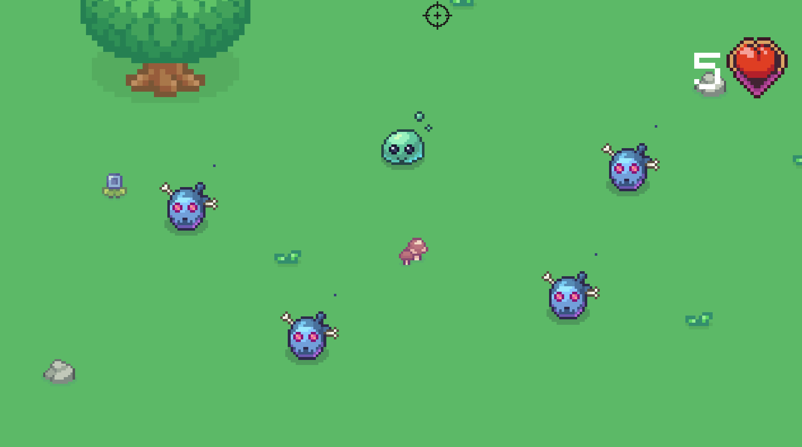
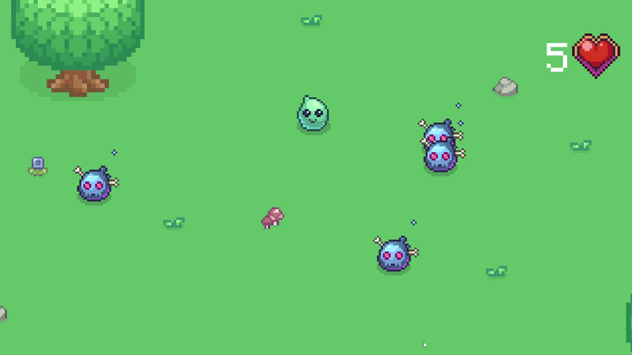

# 🎮 Overtop

A dynamic 2D roguelike with progression elements where the player must clear dungeons from waves of enemies and upgrade their stats in the shop.

---

## ✨ Project Features
* **Dynamic Progression:** A system for upgrading the player's health, damage, and speed via the shop.
* **Data Architecture:** Player and upgrade data are implemented using ScriptableObjects for flexible balance tweaking.
* **Enemy AI:** Implemented using a StateMachine.
* **Shooting:** Implemented using Object Pooling.

---

## 🛠️ Tech Stack & Tools
* **Engine:** Unity [6000.3.7f1]
* **Rendering:** [URP / Built-in / 2D]
* **Programming Language:** C#
* **Additional Packages:** TextMesh Pro, NavMeshPlus-master
* **Graphics:** Pixel Skies DEMO, 2D Pixel Dungeon Asset Pack, Nature_Fantasy_Asset_Pack_Free, Sprout Lands - Sprites - Basic pack, Sprout Lands - UI Pack - Basic pack, Google Gemini AI

## Screenshots

## Demo

## 🎓 What I Learned (Development Experience)

This was developed as an educational project. My primary focus was on coding, so gameplay quality, engagement, and similar aspects took a back seat. My main goal was to practice software architecture and write code, so I didn't focus on GameFeel at all.

1. Designing architecture and identifying its flaws.
2. Understanding what an Object Pool is and how to work with it.
3. Gaining a deeper understanding of C# Events.
4. Working with the integration between UI and core systems.
5. Gaining experience in seeing a project through to completion.

### 🧠 Project Issues:
1. WalletManager is a Singleton. This is bad practice; such scripts shouldn't be Singletons. While it's acceptable for an InputManager or LevelManager, a WalletManager shouldn't be one. I decided to leave it as a Singleton because I had already spent a lot of time refactoring, and within the scope of this project, it is somewhat acceptable.

2. PlayerController and EnemyController have too many responsibilities. Initially, I thought this was the correct and acceptable approach. Towards the end of the project, after a code review, I realized this was an issue. I decoupled some functionality from them, but they are still not ideal. They still handle responsibilities that should be refactored or delegated, but due to the extensive refactoring I had already done, I decided to leave them as is.

3. Weird hitboxes. The hitboxes on some objects are offset, and I couldn't figure out why. I tried to fix it, but unfortunately without success. I did everything I could, but occasionally these offset hitboxes still occur.

4. Lack of music and sound effects.

5. Clunky gameplay. As mentioned above, my focus was strictly on programming. My goal wasn't to make a highly engaging and polished game, which resulted in a lacking gameplay experience. While expected, this is objectively a downside.

---

## 🛠️ What Was Implemented (My Contributions)

* **Shop:** Implemented the UI, upgrades, Upgrade SOs (ScriptableObjects), a centralized ShopManager mediator, and the integration between them.
* **Player:** Movement, Movement Stats SO, Balance UI, as well as Health and Health UI.
* **Weapon:** Implemented Object Pool and WeaponData.
* **Enemy:** StateMachine and Enemy SO.
* **DropSystem:** Upon enemy death, an event is triggered, spawning a collectible coin at their death location.

---

## 🏗️ Project Structure (For Developers)
All core game files are isolated from third-party plugins and are located in the root `_Project` folder:
* `_Project/Scripts/` — All game logic (architecture, managers, combat system).
* `_Project/Scenes/` — Game levels and the main menu.
* `_Project/Core/` — Core assets, player prefabs, and base settings.

---

## 🚀 How to Run the Project

### For Players (Build):
1. Follow the link (this section will be updated later).
2. Extract the archive and launch the `[Game_Name].exe` file.

### For Developers (In Unity Editor):
1. Clone the repository: `git clone [https://github.com/sigmtima/Overtop.git](https://github.com/sigmtima/Overtop.git)`
2. Open Unity Hub and add the project from the folder.
3. Make sure you are using Unity version **[6000.3.7f1]**.
4. Open the `_Project/Scenes/[MainMenu]` scene and press **Play**.

---

## ⌨️ Controls
* `WASD`  — Player movement
* `LMB`  — Attack

## Project Status

Final Version.